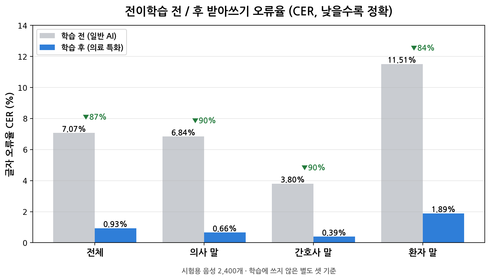

# Voice EMR — 진료 대화를 자동으로 의무기록으로 만들어주는 AI

> 의사와 환자가 나눈 **진료 대화를 녹음하면**, AI가 그 내용을 알아듣고
> **의사가 쓰는 진료기록(차트) 초안까지 자동으로 만들어 주는** 시스템입니다.
>
> 쉽게 말해 — "진료실 대화 녹음 → 받아쓰기 → 요약 정리"를 사람 대신 컴퓨터가 해줍니다.
>
> 상태: 🟢 연구·시범 단계 · 최종 업데이트: 2026-07

---

## 1. 이 프로젝트가 하는 일 (한 문장)

**"진료 대화 음성"을 넣으면 → "정리된 진료기록 초안"이 나옵니다.**

의사는 진료하면서 동시에 기록까지 남겨야 해서 부담이 큽니다.
이 시스템은 그 기록 작업을 자동화해서 **의사가 환자에게 더 집중**할 수 있게 돕는 것이 목표입니다.

---

## 2. 두 단계로 나눠서 이해하기

이 시스템은 크게 두 가지 AI가 협력합니다.

### 🅐 "받아쓰기 AI" — 말을 글자로
녹음된 대화를 듣고 **한국어 텍스트로 받아쓰는** 역할.
(전문용어로 STT = Speech-to-Text, 음성 인식)

### 🅑 "정리 AI" — 글자를 진료기록으로
받아쓴 대화를 읽고 **의사용 표준 서식(SOAP)** 으로 정리하는 역할.
(SOAP = 병원에서 쓰는 진료기록 표준 양식. 아래 4가지로 나눠 적음)

| 항목 | 뜻 | 예시 |
|---|---|---|
| **S** 주관적 | 환자가 말한 증상 | "일주일 전부터 가슴이 답답함" |
| **O** 객관적 | 검사·관찰 결과 | 혈압, 청진 소견 등 |
| **A** 진단 | 의사의 판단 | 의심 질환 |
| **P** 계획 | 앞으로 할 일 | 검사 예약, 처방 |

---

## 3. "전이학습" — AI를 의료 전문가로 재교육한 이야기

### 무엇을 했나 (쉬운 설명)
받아쓰기 AI는 원래 **일반 대화용**이라, 의료 용어를 자주 틀렸습니다. 예를 들어 —

- "고혈압" → "고혀랩" ❌
- "혈액검사" → "혀랩검사" ❌

그래서 **의료 대화 녹음 약 1,450시간**(= 하루 8시간씩 들어도 반 년 넘는 분량)을
AI에게 다시 들려주며 **의료 전문 용어를 학습**시켰습니다.
이렇게 기존 AI에 특정 분야를 추가로 가르치는 것을 **전이학습(Transfer Learning)** 이라고 합니다.

> 비유하자면 — 일반 상식은 갖춘 신입사원에게 **"병원 용어"를 집중 교육**한 셈입니다.
>
> *학습 데이터: 공개 의료 음성 데이터셋(AI Hub 기반). 개인 식별정보가 포함되지 않은 데이터를 사용했습니다.*

### 학습 전 vs 후 — 실제 성적표 📊
학습에 쓰지 않은 **별도 시험용 음성 2,400개**로, 같은 조건에서 전/후를 나란히 측정했습니다.
아래 숫자는 **"글자를 틀린 비율"(CER)** 로, **낮을수록 정확**합니다.

| 대상 | 학습 전 (일반 AI) | 학습 후 (의료 특화) | 얼마나 좋아졌나 |
|---|---:|---:|---:|
| **전체** | 7.07% | **0.93%** | **틀린 글자 약 87% 감소** |
| 의사 말 | 6.84% | 0.66% | 약 90% 감소 |
| 간호사 말 | 3.80% | 0.39% | 약 90% 감소 |
| 환자 말 | 11.51% | 1.89% | 약 84% 감소 |



> 쉽게 말해 — 100글자 받아쓸 때 틀리던 글자가 **약 7개 → 1개 미만**으로 줄었습니다.
> 특히 발화가 다양해 어려운 **"환자 말"의 오류가 11.5% → 1.9%** 로 크게 개선됐습니다.

**실제 예시 (같은 음성, 전 → 후)**

| 정답 | 학습 전 ❌ | 학습 후 ✅ |
|---|---|---|
| 검사는 상황에 따라… | **분산**은 상황에 따라… | 검사는 상황에 따라… |
| 쓸개와 방광의 문제 | **슬개와** 방광에 문제 | 쓸개와 방광의 문제 |
| 약물 알레르기 반응 | **양물** 알레르기 반응 | 약물 알레르기 반응 |

> ※ 학습 전에도 받아쓰기 자체는 준수했지만(정확도 90%대),
> **전이학습으로 "의료 용어를 거의 안 틀리는" 수준(오류 1% 미만)** 까지 끌어올린 것이 핵심 성과입니다.

---

## 4. 실제로 어떻게 작동하나 (전체 흐름)

```
🎙️ 진료 대화 녹음
   │
   ├─ 1단계  누가 말했는지 구분  (의사 / 환자 목소리 나누기)
   ├─ 2단계  각 목소리가 의사인지 환자인지 판별
   ├─ 3단계  받아쓰기  (음성 → 한국어 텍스트) ← 전이학습한 AI
   ├─ 4단계  핵심 키워드 뽑기  (증상·검사·처방 등)
   └─ 5단계  진료기록 정리  (SOAP 서식으로 자동 작성) ← 정리 AI
   ↓
📄 완성된 진료기록 초안
```

**사용 중인 주요 AI 기술**
- 받아쓰기: Whisper 기반 음성인식 (의료 도메인 전이학습 버전)
- 정리: 대형 언어모델(LLM) 기반 SOAP 자동 작성

---

## 5. 앞으로의 방향

- 🔬 진료과별(내과·정형외과 등) **전문 버전**으로 확장
- 🔬 현장 데이터를 반영한 **지속적 성능 개선**
- 📝 진료기록 품질 **자동 평가 체계** 구축, 사실성(환각 방지) 검증 강화
- ⚙️ 실시간 받아쓰기, 처리 속도 최적화, 안정적인 접근 관리

---

## 6. 문의

시범 데모 및 협업 문의는 담당자에게 연락 바랍니다.

---

> **유의사항** — 본 시스템은 진료기록 작성을 **보조**하는 연구·시범 단계 도구입니다.
> 생성된 기록은 **초안**이며, 최종 판단과 확인은 반드시 **의료진**이 수행합니다.
> 시연에 사용된 예시는 공개 데이터셋 기반으로, 실제 환자 정보가 아닙니다.
